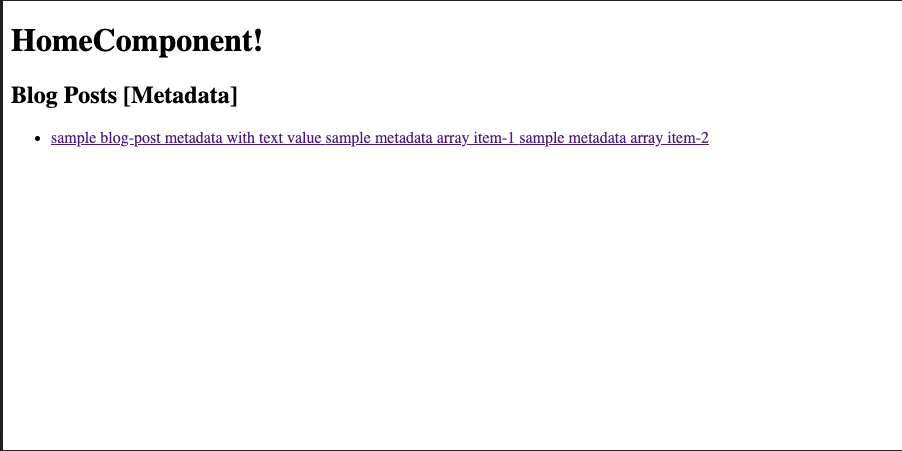
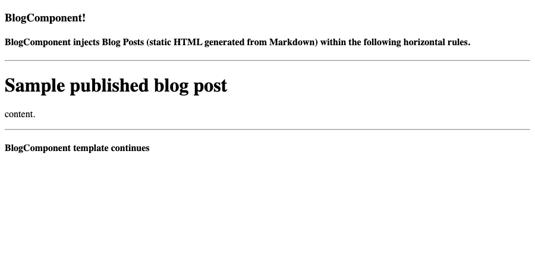

# **Example Angular blog built with Scully SSG**

A sample blog app developed with Angular and built as a static site using
Scully SSG (static site generator). Blog posts are written in markdown files and
converted to static html by Scully's build process.

Scully is a static site generator tool for Angular to build, test and deploy
Jamstack apps.

Instructions for developing and scaffolding, building, and testing this project
are found below.

### **Screenshots**

<figure>
    
    <figcaption><strong>Figure 1</strong>
        Home page. The angular application is built using the angular-cli and then post-processed to a static site using Scully.  
    </figcaption>
</figure>

<figure>
    
    <figcaption><strong>Figure 2</strong>
        Blog post page. The blog post content is written in markdown files and compiled to static html using Scully.
    </figcaption>
</figure>

## **Development server**

## **Run Angular Static Site App with Blog Posts**

Run `npm run start` for a dev server. Navigate to `http://localhost:1668/`. The app will automatically reload if you change any of the source files.

## **Run Angular App Only (without SSG, blog posts)**

Run `npm run _start:ng` for an angular dev server. Navigate to `http://localhost:4200/`. The app will automatically reload if you change any of the source files.

## **Code scaffolding**

Run `ng generate component component-name` to generate a new component. You can also use `ng generate directive|pipe|service|class|guard|interface|enum|module`.

## **Build**

### **Build App as Static Site** (Using Angular CLI + Scully)

Run `ng build` to build the project as static-site, generated by first building
the app using the angular-cli and then building the static site using Scully
SSG (static site generator). The build artifacts will be stored in the `dist/` directory.

 

Run `ng build:ssg` to build the project as static-site only using scully. Note
that the scully build depends on the angular build to have been run first,
(either by running `npm run build:ng` or `npm run build`) using the
angular-cli before. The build artifacts will be stored in the `dist/` directory.

### **Build App as Angular project** (Using Angular CLI Only)

Run `ng build:ng` to build the project using the angular-cli only.
The build artifacts will be stored in the `dist/` directory.

## **Running Tests**

### **Unit tests**

Run `ng test` to execute the unit tests via [Karma](https://karma-runner.github.io).

### **End-to-end tests**

Run `npm run test:e2e` to execute the end-to-end tests via a platform of your choice.
To use this command, you need to first add a package that implements end-to-end testing capabilities.

-----

## **References**

- [Angular](https://angular.io/) and [Angular CLI](https://github.com/angular/angular-cli)

- [Scully](https://scully.io/)

- [Jamstack](https://jamstack.org/)

